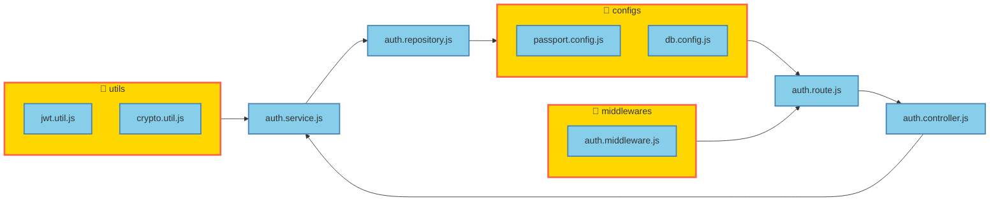
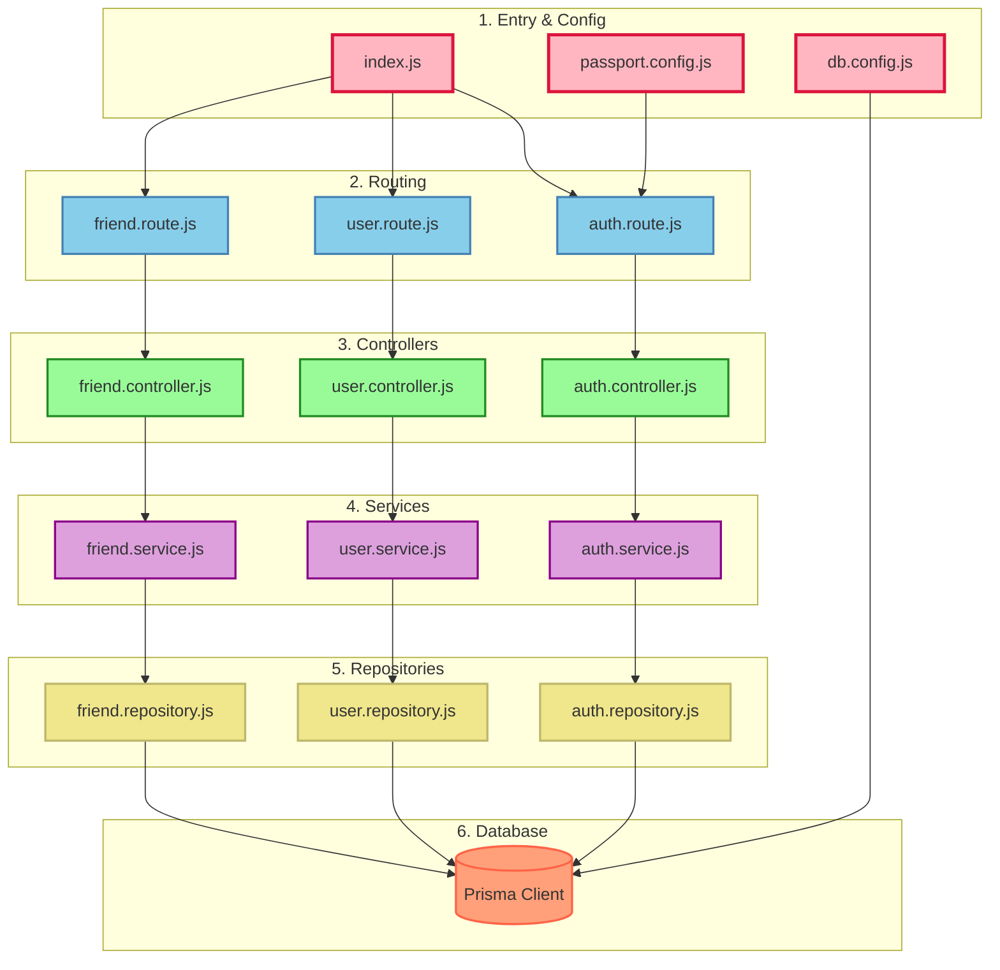

# 프로젝트 아키텍처 다이어그램 만들기 가이드

프론트엔드처럼 보기 좋은 의존성 그래프를 만드는 방법입니다.

## 1. 기본 구조

프론트엔드 다이어그램은 이런 구조입니다:

```
[폴더] -> [중간 파일들] -> [최종 사용 파일들]
```

예시:
```
configs -> passport.config.js -> auth.controller.js -> auth.service.js
```

## 2. Mermaid 다이어그램 작성법

### 기본 템플릿

```mermaid
flowchart LR    %% LR = 왼쪽에서 오른쪽으로
    
    %% 폴더 정의
    subgraph CONSTANTS["📁 configs"]
        CONFIG1[passport.config.js]
        CONFIG2[db.config.js]
    end
    
    %% 핵심 파일들
    CTRL[auth.controller.js]
    SVC[auth.service.js]
    REPO[auth.repository.js]
    
    %% 의존성 연결 (왼쪽 -> 오른쪽)
    CONSTANTS --> CTRL
    CTRL --> SVC
    SVC --> REPO
    
    %% 색상 스타일
    classDef folder fill:#FFD700,stroke:#FF6347,stroke-width:3px
    classDef file fill:#87CEEB,stroke:#4682B4,stroke-width:2px
    
    class CONSTANTS folder
    class CTRL,SVC,REPO file
```

## 3. 우리 프로젝트 구조

### 레이어별 의존성

```
┌─────────────┐
│  index.js   │  (엔트리 포인트)
└──────┬──────┘
       │
       v
┌─────────────┐
│   routes    │  (라우팅)
└──────┬──────┘
       │
       v
┌─────────────┐
│ controllers │  (컨트롤러)
└──────┬──────┘
       │
       v
┌─────────────┐
│  services   │  (비즈니스 로직)
└──────┬──────┘
       │
       v
┌─────────────┐
│repositories │  (데이터 접근 추상화)
└──────┬──────┘
       │
       v
┌─────────────┐
│   Prisma    │  (ORM - DB 쿼리 생성)
└──────┬──────┘
       │
       v
┌─────────────┐
│  MySQL DB   │  (실제 데이터베이스)
└─────────────┘
```

**중요**: Prisma는 ORM(Object-Relational Mapping)으로, MySQL과 repositories 사이의 중간 계층입니다.

### 🎯 쉽게 이해하기

```
Repository는 "레스토랑 서빙 직원" 같고,
Prisma는 "주방" (재료 준비/요리),
MySQL은 "냉장고" (실제 데이터 보관)
```

- **Repository**: "고객님께 서비스를 제공" → 복잡한 로직 없이 간단한 함수
- **Prisma**: "재료를 찾아서 요리 준비" → SQL을 JS 함수로 변환
- **MySQL**: "진짜 음식이 있는 곳" → 실제 데이터 저장소

### 각 계층의 역할 이해하기

#### 1. Repository (repositories/)
**역할**: Prisma Client를 사용해서 간단한 DB 쿼리 함수들 제공
**예시**: `auth.repository.js`
```javascript
import { prisma } from "../configs/db.config.js";

export const getUserSignIn = async (data) => {
  // Prisma Client 사용해서 DB 쿼리
  const user = await prisma.user.findFirstOrThrow({
    where: { email: data.email }
  });
  return user;
};
```

#### 2. Prisma
**역할**: ORM (Object-Relational Mapping) - MySQL 쿼리를 JavaScript 함수로 변환
**작동 방식**:
- `schema.prisma`: DB 모델 정의 (테이블 구조)
- `prisma.client`: 실제 쿼리 생성 및 실행
- `prisma.user.findFirst()` → `SELECT * FROM user WHERE ... LIMIT 1`

#### 3. MySQL
**역할**: 실제 데이터를 저장하는 데이터베이스

### 주요 폴더와 그 역할

1. **configs**: 설정 파일들
   - passport.config.js (소셜 로그인)
   - db.config.js (Prisma Client 인스턴스)
   - cors.config.js (CORS 설정)

2. **middlewares**: 미들웨어
   - auth.middleware.js (인증)
   - error.middleware.js (에러 처리)

3. **utils**: 유틸리티 함수
   - jwt.util.js (토큰 관리)
   - crypto.util.js (암호화)

4. **routes**: 라우팅
   - auth.route.js
   - user.route.js
   - friend.route.js

5. **controllers**: 컨트롤러
   - auth.controller.js
   - user.controller.js
   - friend.controller.js

6. **services**: 비즈니스 로직
   - auth.service.js
   - user.service.js
   - friend.service.js

7. **repositories**: 데이터베이스 접근
   - auth.repository.js
   - user.repository.js
   - friend.repository.js

## 4. 실제 작성 예시

### Auth 기능 다이어그램



## 5. Mermaid 주요 문법

### 방향 지정
- `flowchart TB`: 위에서 아래로
- `flowchart LR`: 왼쪽에서 오른쪽으로
- `flowchart TD`: 위에서 아래로 (TB와 동일)

### 파일 그룹화
```
subgraph 그룹명["폴더명"]
    파일1[파일명.js]
    파일2[파일명2.js]
end
```

### 연결선
```
파일1 --> 파일2    %% 단방향 화살표
파일1 --- 파일2    %% 양방향 연결
```

### 스타일링
```
classDef 스타일명 fill:#색상,stroke:#테두리색,stroke-width:크기
class 변수명 스타일명
```

### 색상 팔레트
```
folder: #FFD700 (금색)
file: #87CEEB (하늘색)
config: #98FB98 (연녹색)
error: #FF6347 (토마토색)
```

## 6. 온라인 도구로 보기

생성한 `.mmd` 파일을 다음에서 확인할 수 있습니다:

1. **VS Code**: Mermaid Preview 확장 설치
2. **GitHub**: `.md` 파일에 포함하면 자동 렌더링
3. **온라인**: https://mermaid.live/ 에 붙여넣기

## 7. 전체 구조 다이어그램 예시

프로젝트 전체를 한눈에 보려면:



## 8. 팁

1. **간단하게 시작**: 핵심 기능 2-3개만 먼저 그려보기
2. **레이어 구분**: 폴더별로 구분하면 가독성↑
3. **색상 활용**: 폴더별로 다른 색 사용
4. **화살표 방향**: 왼쪽→오른쪽 또는 위→아래 일관성 유지
5. **간결하게**: 모든 파일 넣지 말고 주요 파일만

## 9. 빠른 생성

이미 만들어진 `architecture-diagram.mmd` 파일을 수정하면 됩니다!

```bash
# 파일 열기
code architecture-diagram.mmd

# 온라인에서 보기
# https://mermaid.live/ 에서 내용 붙여넣기
```

